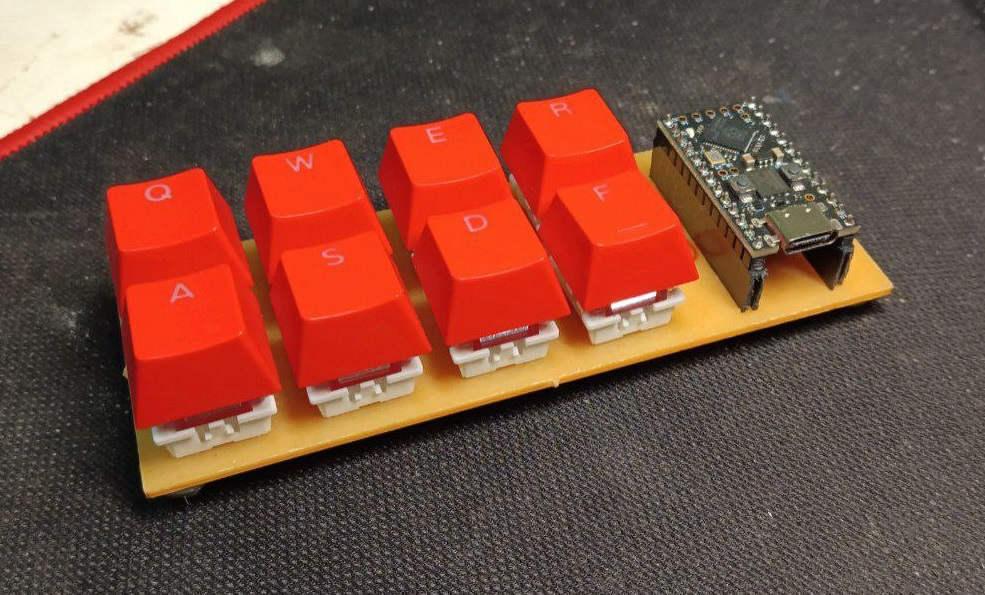

# Only_Arsey

### Description
An 8-key keyboard powered by Promicro RP2040, designed for the sake of learning keyboard manufatcuring and as a hobby project. I designed the PCB, manufactured it at my educational institution, and soldered the switches directly onto the board. I used Otemu Purple Switches and keycaps sourced from AliExpress. The firmware is an adapted version of ARTSEY for QMK.

#### The future
I'm currently working on a wearable version of this keyboard with BLE, using the ZMK firmware and the Supermini nRF52840 microcontroller

* Keyboard Maintainer: [Franko12345](https://github.com/Franko12345)
* Hardware Supported: Built for promicro RP2040
* Hardware Availability: [Promicro RP2040](https://www.googleadservices.com/pagead/aclk?sa=L&ai=DChcSEwias5PBzM-GAxWcysIEHay4D9oYABAIGgJwdg&ase=2&gclid=Cj0KCQjwpZWzBhC0ARIsACvjWRNx583eBPv7O8cDMu-x8fDkl747PsuyrpZ9Y_tGSJjxLyAhuAPO5owaAk7OEALw_wcB&ohost=www.google.com&cid=CAESVeD2c9YQo3_r3LFuoUtQnqvHv0y6r4gatLaKgmOYp5_u12UjmnztgwGvgo5S0wY6bQtp-5ucmjHBMrJHF1qMLFOefOq5MTo9CVpQJV4Og5Kt1v7qLs0&sig=AOD64_3HUA42WHkUQPvZG8-kDR7W4-Tw-A&ctype=5&q=&nis=4&ved=2ahUKEwiQ24fBzM-GAxXOq5UCHRtfAR4Q9aACKAB6BAgEEBA&adurl=)

See the [build environment setup](https://docs.qmk.fm/#/getting_started_build_tools) and the [make instructions](https://docs.qmk.fm/#/getting_started_make_guide) for more information. Brand new to QMK? Start with our [Complete Newbs Guide](https://docs.qmk.fm/#/newbs).

## Bootloader

Enter the bootloader in 3 ways:

* **Bootmagic reset**: Hold down the key at (0,0) in the matrix (usually the top left key or Escape) and plug in the keyboard
* **Physical reset button**: Briefly press the button on the back of the PCB - some may have pads you must short instead
* **Keycode in layout**: Press the key mapped to `QK_BOOT` if it is available